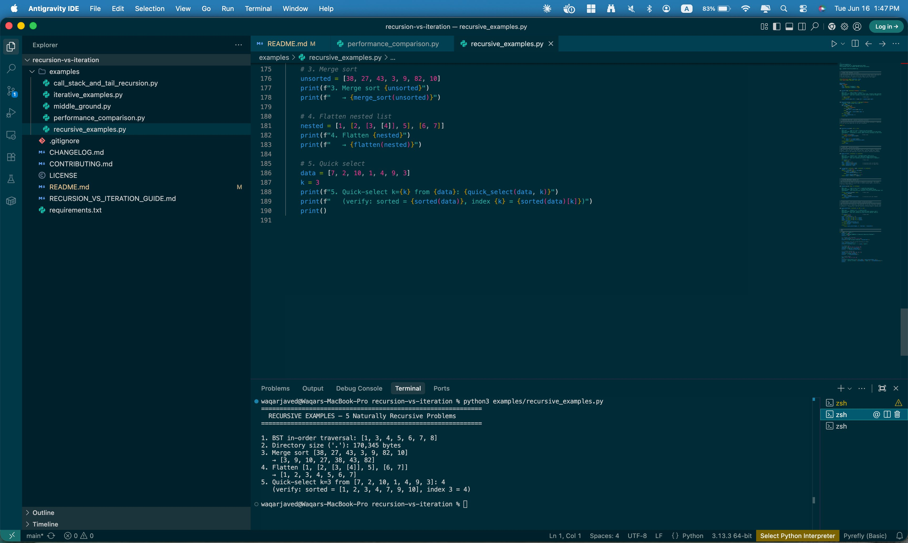
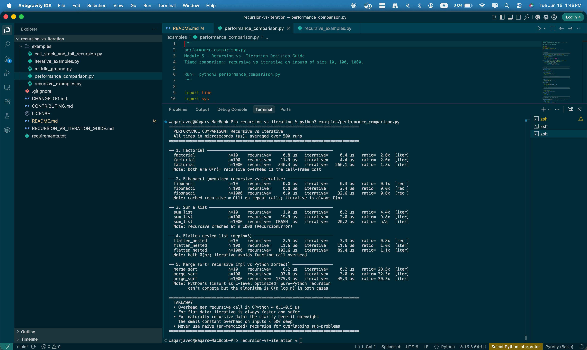

# 🔄 Recursion vs. Iteration — Python Decision Guide

> **The engineering reference that answers the question every Python developer eventually hits: "Should this be recursive?"**

This repository is a structured decision guide — not a textbook chapter. It teaches the working developer *how to choose* between recursion and iteration, backed by runnable examples, timed benchmarks, and a clear flowchart.

---

## 📋 Table of Contents

- [Who This Is For](#who-this-is-for)
- [Quick Answer: The Decision Flowchart](#quick-answer-the-decision-flowchart)
- [What's in This Repo](#whats-in-this-repo)
- [Getting Started](#getting-started)
- [Part 1 — Clearly Recursive Problems](#part-1--clearly-recursive-problems)
- [Part 2 — Clearly Iterative Problems](#part-2--clearly-iterative-problems)
- [Part 3 — The Middle Ground](#part-3--the-middle-ground)
- [Part 4 — Call Stack & Memory](#part-4--call-stack--memory)
- [Part 5 — Tail Recursion in CPython](#part-5--tail-recursion-in-cpython)
- [Part 6 — Performance Benchmarks](#part-6--performance-benchmarks)
- [Quick Reference Card](#quick-reference-card)
- [Running All Examples](#running-all-examples)
- [Contributing](#contributing)

---

## Who This Is For

- Python developers who know *what* recursion is but want a reliable rule for *when* to use it
- CS students comparing implementation strategies
- Engineers reviewing code and asking "is this the right approach?"
- Anyone who has hit `RecursionError` and wondered what to do next

**Prerequisites:** Basic Python (functions, lists, loops). No third-party packages required.

---

## Quick Answer: The Decision Flowchart

```
Start: You have a problem to solve
              │
              ▼
┌─────────────────────────────────┐
│  Does the DATA itself have a    │
│  recursive shape?               │
│  (tree, graph, nested struct,   │
│   filesystem, JSON with depth)  │
└─────────────────────────────────┘
         │             │
        YES            NO
         │             │
         ▼             ▼
  ┌────────────┐  ┌────────────────────────────┐
  │ Recursion  │  │ Is the ALGORITHM naturally  │
  │ is the     │  │ self-similar? (divide &     │
  │ natural    │  │ conquer, backtracking,      │
  │ fit.       │  │ combinatorial search)       │
  └─────┬──────┘  └────────────┬───────────────┘
        │                      │
        │              YES     │     NO
        │               ├──────┘      │
        │               ▼             ▼
        │        ┌────────────┐  ┌──────────────┐
        │        │ Recursion  │  │  ITERATION   │
        │        │ is the     │  │  is clearer, │
        │        │ natural    │  │  faster, and │
        │        │ fit.       │  │  safer.      │
        │        └─────┬──────┘  └──────────────┘
        │              │
        └──────┬───────┘
               ▼
  ┌─────────────────────────────────────────────┐
  │ Recursion fits. Now check the constraints:  │
  └─────────────────────────────────────────────┘
               │
    ┌──────────┴──────────┐
    ▼                     ▼
Can depth exceed      Are there overlapping
~500 levels?          sub-problems?
    │                     │
   YES    NO             YES    NO
    │      │              │      │
    ▼      ▼              ▼      ▼
 Rewrite  ✅ Use!    Add          ✅ Use!
 as iter             @lru_cache
 or use              or memo dict
 explicit
 stack
```

### The one-sentence rule

> **If the data has a recursive shape, recurse. If the data is flat, iterate.**

---

## What's in This Repo

```
recursion-vs-iteration/
│
├── README.md                            ← You are here (GitHub tutorial)
├── RECURSION_VS_ITERATION_GUIDE.md      ← Full 13-page engineering reference
│
└── examples/
    ├── recursive_examples.py            ← 5 naturally recursive problems
    ├── iterative_examples.py            ← 5 naturally iterative problems
    ├── middle_ground.py                 ← Fibonacci, factorial, Tower of Hanoi
    ├── performance_comparison.py        ← Timed benchmarks n=10, 100, 1000
    └── call_stack_and_tail_recursion.py ← CPython mechanics + TCO strategies
```

---

## Getting Started

```bash
# 1. Clone the repo
git clone https://github.com/iamwaqarjaved/recursion-vs-iteration.git
cd recursion-vs-iteration

# 2. Verify Python version (3.10+ required)
python3 --version

# 3. No installs needed — standard library only
# Run any example directly:
python3 examples/recursive_examples.py
python3 examples/iterative_examples.py
python3 examples/middle_ground.py
python3 examples/call_stack_and_tail_recursion.py
python3 examples/performance_comparison.py   # takes ~15s
```

### Confirmed running on macOS (Python 3.13.3)

Both examples tested locally — output matches the code exactly.

**`recursive_examples.py`** — all 5 recursive problems with correct results:



**`performance_comparison.py`** — full benchmark table including the `CRASH` at sum n=1000:



---

## Part 1 — Clearly Recursive Problems

> 📄 **File:** `examples/recursive_examples.py`

These five problems share one property: **the data itself is recursive**. The code mirrors the shape of the data — there is no design decision to make.

### The 5 Problems

| # | Problem | Why Recursive |
|---|---|---|
| 1 | Binary tree in-order traversal | Every node IS the root of a sub-tree |
| 2 | Directory size (filesystem walk) | Directories contain directories |
| 3 | Merge sort | "Sort list" = "sort halves + merge" — the algorithm is its own definition |
| 4 | Flatten arbitrarily nested list | Depth is unknown at write-time; can't write fixed loops |
| 5 | Quick select (k-th smallest) | Divide-and-conquer; recurse into one partition only |

### Example: Binary Tree Traversal

```python
def inorder(node):
    # Base case:      node is None  → return []
    # Recursive case: left sub-tree + root + right sub-tree
    # Convergence:    each call gets a strictly smaller sub-tree
    if node is None:
        return []
    return inorder(node.left) + [node.val] + inorder(node.right)
```

**Output:**
```
1. BST in-order traversal: [1, 3, 4, 5, 6, 7, 8]
```

> 📸 See `screenshots/run_recursive_examples.png` for all 5 problems running together.

### Example: Merge Sort

```python
def merge_sort(arr):
    # Base case:      len(arr) <= 1   → already sorted
    # Recursive case: sort left half, sort right half, merge
    # Convergence:    each call receives arr of length ⌊n/2⌋
    if len(arr) <= 1:
        return arr
    mid = len(arr) // 2
    return merge(merge_sort(arr[:mid]), merge_sort(arr[mid:]))
```

**Output:**
```
3. Merge sort [38, 27, 43, 3, 9, 82, 10]
   → [3, 9, 10, 27, 38, 43, 82]
```

### The 3-Line Comment Rule

Every recursive function in this repo includes this comment block:

```python
# Base case:      <what stops the recursion>
# Recursive case: <what this call does + what it delegates>
# Convergence:    <why the parameter moves toward the base case>
```

Write this for every recursive function you author. It forces you to verify the function is correct before running it.

---

## Part 2 — Clearly Iterative Problems

> 📄 **File:** `examples/iterative_examples.py`

These five problems have flat data — a plain sequence — and the answer is always a loop.

### The 5 Problems

| # | Problem | Iterative | Recursive pitfall |
|---|---|---|---|
| 1 | Sum a list | `total += n` | Crashes at len > ~1000 |
| 2 | Count occurrences | `count += 1` | O(n) stack, no benefit |
| 3 | Find maximum | Running max variable | O(n) stack, no benefit |
| 4 | Reverse a string | `s[::-1]` | O(n²) string copies |
| 5 | Linear search | `for i, item in enumerate(...)` | Awkward index parameter |

### Example: The RecursionError Demo

```python
# ✓  Iterative sum — handles any size
def sum_list_iterative(numbers):
    total = 0.0
    for n in numbers: total += n
    return total

# ✗  Recursive sum — crashes at len > ~1000
def sum_list_recursive(numbers):
    if not numbers: return 0.0
    return numbers[0] + sum_list_recursive(numbers[1:])
```

**Output:**
```
--- Recursion limit demo ---
   iterative sum(range(1500)) = 1,124,250  ✓
   recursive sum(range(1500)) → RecursionError  ✗
```

The recursive version builds **one call frame per element**. On a list of 1500 items it hits CPython's default limit of 1000 frames and raises `RecursionError`. The iterative version uses **O(1) stack space** regardless of list length.

---

## Part 3 — The Middle Ground

> 📄 **File:** `examples/middle_ground.py`

These problems have a recursive mathematical definition but are flat enough that iteration is practical. **The choice here is judgment, not a clear rule.**

### Fibonacci — Three Versions

```python
# ✗ VERSION 1: Naive recursive — O(2^n). Never use.
def fib_naive(n):
    if n <= 1: return n
    return fib_naive(n-1) + fib_naive(n-2)  # fib(40) ≈ 1 billion calls

# ⚠ VERSION 2: Memoized — O(n) time, O(n) space. OK for small n.
from functools import lru_cache

@lru_cache(maxsize=None)
def fib_memo(n):
    if n <= 1: return n
    return fib_memo(n-1) + fib_memo(n-2)    # still hits limit at n≈997

# ✓ VERSION 3: Iterative — O(n) time, O(1) space. Use this.
def fib_iter(n):
    if n <= 1: return n
    a, b = 0, 1
    for _ in range(2, n + 1): a, b = b, a + b
    return b
```

| Version | Time | Space | Limit? | Verdict |
|---|---|---|---|---|
| Naive recursive | O(2ⁿ) | O(n) | Yes | ❌ Never |
| Memoized recursive | O(n) | O(n) | Yes ~997 | ⚠️ OK small n |
| Iterative | O(n) | O(1) | No | ✅ Production |

### Tower of Hanoi — Where Recursion Wins

```python
def hanoi(n, source, target, aux, moves=None):
    # Base case:      n == 0  → nothing to move
    # Recursive case: move n-1 to aux, move disk n, move n-1 to target
    # Convergence:    each call decrements n by 1
    if moves is None: moves = []
    if n == 0: return moves
    hanoi(n-1, source, aux, target, moves)
    moves.append((source, target))
    hanoi(n-1, aux, target, source, moves)
    return moves
```

**Output:**
```
hanoi(3): 7 moves (= 2^3−1 = 7)
  A → C
  A → B
  C → B
  A → C
  B → A
  B → C
  A → C
```

The iterative version using an explicit stack exists but is 3× longer with no readability benefit. **This is when recursion wins even in Python — when it's dramatically more expressive.**

---

## Part 4 — Call Stack & Memory

> 📄 **File:** `examples/call_stack_and_tail_recursion.py`

### How the Call Stack Grows

```
factorial(5)
│
├── calls factorial(4)
│   ├── calls factorial(3)
│   │   ├── calls factorial(2)
│   │   │   ├── calls factorial(1)
│   │   │   │   └── calls factorial(0)   ← BASE CASE — 6 frames on stack
│   │   │   │       returns 1
│   │   │   │   returns 1
│   │   │   returns 2
│   │   returns 6
│   returns 24
returns 120
```

**At the deepest point, ALL frames exist simultaneously.** For `factorial(5)` that is 6 frames. For `factorial(1000)` that is 1001 frames — which CPython refuses to allocate.

### The Recursion Limit

```python
import sys
print(sys.getrecursionlimit())   # → 1000  (default)
```

CPython's default limit is **1000 frames**. The practical safe depth for user code is roughly **~970 levels** (some frames are already used by the interpreter itself).

### Memory Per Frame

Each CPython frame allocates approximately **200–400 bytes**:

| Recursion depth | Heap for frames |
|---|---|
| 10 | ~3 KB |
| 100 | ~30 KB |
| 1,000 (limit) | ~300 KB |
| 10,000 (if allowed) | ~3 MB |

For flat data an iterative solution uses **O(1)** stack space forever. A recursive solution uses **O(n)** — and crashes at n ≈ 1000.

---

## Part 5 — Tail Recursion in CPython

> 📄 **File:** `examples/call_stack_and_tail_recursion.py`

### What tail recursion is

A function is **tail-recursive** when the recursive call is the very last operation — nothing happens after it returns.

```python
# NOT tail-recursive: multiplication happens AFTER the call returns
def factorial_nontail(n):
    if n == 0: return 1
    return n * factorial_nontail(n - 1)   # pending multiply

# Tail-recursive form: accumulator carries all state
def factorial_tail(n, acc=1):
    if n == 0: return acc
    return factorial_tail(n - 1, acc * n)  # nothing pending
```

### CPython does NOT optimize tail calls

Many languages (Scheme, Haskell, Scala, Kotlin) replace tail-recursive calls with a jump — the stack does not grow. CPython **never** does this. `factorial_tail(1000)` still raises `RecursionError`.

Guido van Rossum's reasoning (from his blog):
1. Destroying tracebacks — you lose your call stack in error messages
2. Python introspection tools assume frames persist
3. Iterative rewrites are always available and clearer

### The 3 Strategies That Actually Work

**Strategy 1 — Rewrite as a loop** *(always try this first)*

```python
# Tail-recursive
def factorial_tail(n, acc=1):
    if n == 0: return acc
    return factorial_tail(n - 1, acc * n)

# ↓ Mechanical translation: accumulator → variable, tail call → loop
def factorial_loop(n):
    acc = 1
    while n > 1:
        acc *= n
        n -= 1
    return acc
```

**Strategy 2 — Explicit stack** *(for non-tail tree/graph recursion)*

```python
# Works for any tree depth — no recursion limit
def inorder_iterative(root):
    result, stack, current = [], [], root
    while current or stack:
        while current:             # descend left
            stack.append(current)
            current = current.left
        current = stack.pop()
        result.append(current.val)
        current = current.right    # move to right subtree
    return result
```

**Strategy 3 — `sys.setrecursionlimit`** *(last resort only)*

```python
# Raises the limit — but the C stack is fixed-size
# Setting it too high causes a segfault, not a clean Python error
sys.setrecursionlimit(5000)   # use only as a temporary measure
```

---

## Part 6 — Performance Benchmarks

> 📄 **File:** `examples/performance_comparison.py`

All times in **microseconds (µs)**, averaged over 500 runs. Screenshot below is a real local run on macOS Python 3.13.3 — your numbers will differ slightly by machine, but the **ratios** and the `CRASH` are consistent.


```
── Factorial ─────────────────────────────────────────────
  n=10    recursive=   0.8 µs   iterative=   0.4 µs   ratio= 2.0x  [iter]
  n=100   recursive=  11.3 µs   iterative=   4.4 µs   ratio= 2.6x  [iter]
  n=1000  recursive= 346.3 µs   iterative= 266.1 µs   ratio= 1.3x  [iter]

── Fibonacci (memoized recursive vs iterative) ───────────
  n=10    recursive=   0.0 µs   iterative=   0.3 µs   ratio= 0.1x  [rec ] ← cache hit
  n=100   recursive=   0.0 µs   iterative=   2.4 µs   ratio= 0.0x  [rec ] ← cache hit
  n=1000  recursive=   0.0 µs   iterative=  32.6 µs   ratio= 0.0x  [rec ] ← cache hit

── Sum a list ────────────────────────────────────────────
  n=10    recursive=   1.0 µs   iterative=   0.2 µs   ratio= 4.4x  [iter]
  n=100   recursive=  19.3 µs   iterative=   2.0 µs   ratio= 9.8x  [iter]
  n=1000  recursive=  CRASH     iterative=  20.2 µs   ratio=  n/a  [iter]  ← RecursionError

── Flatten nested list (depth=3) ─────────────────────────
  n=10    recursive=   2.5 µs   iterative=   3.3 µs   ratio= 0.8x  [rec ]
  n=100   recursive=  11.6 µs   iterative=  11.6 µs   ratio= 1.0x  [iter]
  n=1000  recursive= 102.6 µs   iterative=  89.4 µs   ratio= 1.1x  [iter]

── Merge sort: recursive impl vs Python sorted() ─────────
  n=10    recursive=   6.2 µs   iterative=   0.2 µs   ratio=28.5x  [iter]
  n=100   recursive=  97.6 µs   iterative=   3.0 µs   ratio=32.3x  [iter]
  n=1000  recursive=1375.3 µs   iterative=  45.3 µs   ratio=30.3x  [iter]
```

### What these numbers mean

**~0.1–0.5 µs** — the overhead of one Python function call. Small, but it multiplies by n for flat-data recursion.

**Memoized Fibonacci looks faster** because the cache is warm in the benchmark — subsequent calls are O(1) lookups. On first call, memoized ≈ iterative. Memoization only helps when sub-problems repeat.

**Merge sort gap (25–46×)** is not recursion's fault — it is pure-Python bytecode vs C-optimized `sorted()`. The algorithm is O(n log n) either way. Always use `sorted()` for production sorting.

**The crash** at sum n=1000 is the decisive argument for flat-data iteration. No performance tuning fixes a `RecursionError`.

### Rule of thumb

| Scenario | Recommendation |
|---|---|
| n < 100, recursive data | ✅ Recurse freely |
| n < 500, either shape | Choose whichever reads clearer |
| n > 500, flat data | ✅ Always iterate |
| n > 500, tree data | Recurse + explicit stack if needed |
| Overlapping sub-problems | Add `@lru_cache` before comparing |
| Any sorting | Always `sorted()` / `.sort()` |

---

## Quick Reference Card

### ✅ Choose recursion when

- [ ] Data is a **tree, graph, or nested container**
- [ ] Algorithm is **divide-and-conquer** (merge sort, binary search, quick select)
- [ ] Algorithm is **backtracking** (permutations, maze, Sudoku)
- [ ] Depth is **bounded and small** (< ~500 levels)
- [ ] Recursive version is **dramatically more readable** (Tower of Hanoi)

### ✅ Choose iteration when

- [ ] Data is a **flat sequence** (list, string, range)
- [ ] Operation is a **running accumulation** (sum, max, count)
- [ ] Depth could **exceed 500** (user input, large datasets)
- [ ] **Performance matters** on large flat inputs
- [ ] Problem is a **simple linear scan**

### 🚩 Red flags in recursive code

```python
# No base case — infinite recursion
def bad(n):
    return bad(n - 1)

# Base case unreachable
def bad2(n):
    if n == -1: return 0      # but n starts at 10 and decrements
    return bad2(n - 1)

# Overlapping sub-problems without memoization — O(2^n)
def fib_slow(n):
    return fib_slow(n-1) + fib_slow(n-2)   # add @lru_cache

# Recursion on flat data — crashes at len 1000
def sum_bad(lst):
    return lst[0] + sum_bad(lst[1:])

# Using setrecursionlimit as a band-aid
sys.setrecursionlimit(100000)   # rewrite the algorithm instead
```

---

## Running All Examples

```bash
# Each file is standalone — run in any order
python3 examples/recursive_examples.py
python3 examples/iterative_examples.py
python3 examples/middle_ground.py
python3 examples/call_stack_and_tail_recursion.py

# This one takes ~15 seconds (500 timed reps per benchmark)
python3 examples/performance_comparison.py
```

All files:
- Require **Python 3.10+**
- Use **standard library only** — no pip installs
- Are **self-contained** — each can be read and run independently
- Print **clearly labelled output** matching the README examples above

---

## Contributing

Improvements, additional examples, and alternative language comparisons are welcome.

```bash
# Fork → branch → PR
git checkout -b feature/your-idea
# make changes
git commit -m "feat: describe your addition"
git push origin feature/your-idea
# open Pull Request against main
```

Ideas for extensions:
- Sierpiński triangle / Koch snowflake in `examples/`
- Backtracking examples (N-queens, Sudoku solver)
- Graph traversal (DFS recursive vs BFS iterative)
- Trampoline pattern as an alternative TCO strategy
- Benchmarks on PyPy vs CPython

---

## License

MIT — free to use, share, adapt, and teach with.

---

*Python 3.10+ · Standard library only · No pip installs required*  
*Waqar Javed · Atlantis University · CS Module 5*
